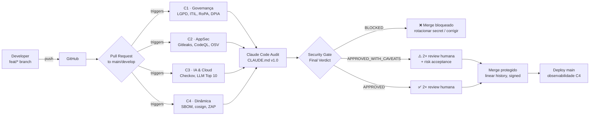
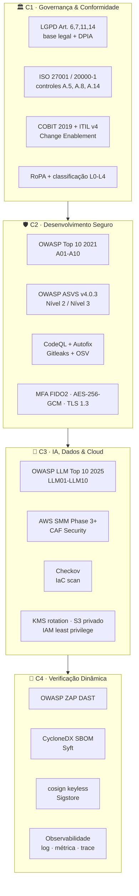
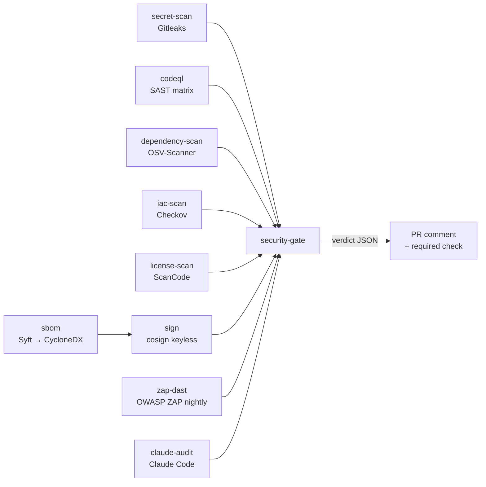

# Arquitetura — MDP Security Gate v1.0

Visão integrada das 4 camadas (C1–C4), do pipeline e do papel do auditor Claude Code
como *first-pass* obrigatório antes da revisão humana.

## Fluxo macro

## Quatro camadas do gate

## Matriz de responsabilidade

| Camada | Responsável técnico | Responsável de negócio | Framework-chave |
|--------|---------------------|------------------------|-----------------|
| C1 | Head of IT | DPO + Jurídico | LGPD, ISO 27001, ITIL v4 |
| C2 | Tech Lead | Head of IT | OWASP Top 10 + ASVS |
| C3 | Arquiteto de IA/Cloud | Head of IT | OWASP LLM · AWS SMM |
| C4 | DevSecOps | Head of IT | ZAP · Sigstore · SBOM |

## Jobs do pipeline (.github/workflows/security.yml)

## Classificação de dado (MDP)

| Nível | Descrição | Exemplo no MDP | Controles mínimos |
|-------|-----------|----------------|-------------------|
| **L0** | Público | Marca, posts institucionais | Nenhum específico |
| **L1** | Interno | Documentação técnica | Auth corporativa |
| **L2** | Confidencial | Contratos, KPIs agregados | RBAC + log de acesso |
| **L3** | Restrito | Dado pessoal de adulto (staff) | ASVS L2 + CMK compartilhada |
| **L4** | **Dado de menor** | InBody, RLP, vídeo, métricas de Lucas e coortes | **ASVS L3 · CMK dedicada por tenant · DPIA obrigatória · consentimento parental co-titulado · retenção mínima necessária · logs sem PII** |

## Vereditos possíveis

| Verdict | Condição | Efeito |
|---------|----------|--------|
| ✅ `APPROVED` | 0 CRITICAL/HIGH · C1 completa · MEDIUM com plano | Libera *merge* após 2× review humana |
| ⚠️ `APPROVED_WITH_CAVEATS` | MEDIUM/LOW com *risk acceptance* formal + prazo | Libera com assinatura do Head of IT |
| ❌ `BLOCKED` | qualquer CRITICAL · HIGH sem mitigação · C1 incompleta · dado L4 sem DPIA · secret exposto | *Merge* bloqueado; secret deve ser rotacionado imediatamente |

---

*Diagramas em Mermaid — renderizam nativamente no GitHub. Exporte para SVG via
[mermaid.live](https://mermaid.live) se precisar embutir no PPTX da tese.*
